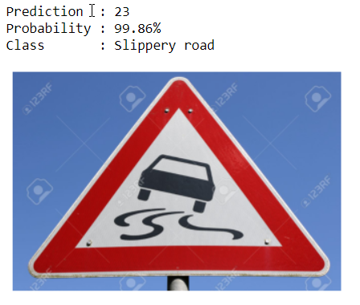

# SELF DRIVING CAR DEMO

## OVERVIEW

---

A demo of self driving car made with unity by Udacity. The driver is a regression model which predicts the steering angle provided the camera view from three cameras installed in LEFT, RIGHT and CENTER of the car. 

  
There are also projects for self driving car in this repo such as 

1. Lane Detection 
     
2. Pedestrian and Vehicle Detection 
      
3. Road Sign Classification 
   

## DEPENDENCIES

---

-   opencv
-   numpy
-   pandas
-   keras
-   scikit learn
-   flask
     install the missing dependencies using pip/conda install

## USAGE

---

Just run the jupyter notebooks in the terminal and you can visit the notebook in your web browser. Install jupyter notebook from here.  
To run the car simulator, 

1. Download the Udacity simulator from here.
2. Install Unity. (required to run the simulator)
3. Run _drive.py_ from this repo on your terminal
4. If there are missing dependencies, solve it with pip
5. Open the Udacity simulator in autonomous mode
6. Car will drive automatically

## APPROACH

---

We collect the image data by driving through _train mode_ in the simulator. Upon saving each images by the simulator, there corresponds a steering angle saved with it at that instance.
 
We have to complete 6 laps in each direction of the road in order for the model to generalize. Else it will predict the steering angle in one direction only.
 
Now the data is fed into a Convolutional network, here we used the network architecture provided by [Nvidia](https://developer.nvidia.com/blog/deep-learning-self-driving-cars/).
 
Now the trained model will predict the steering angle in the autonomous mode of the simulator.

## CREDITS

---

-   Nvidia [blog](https://developer.nvidia.com/blog/deep-learning-self-driving-cars/) on deep learning on self driving cars
-   The Complete Self-Driving Car Course - Applied Deep Learning [udemy](https://www.udemy.com/course/applied-deep-learningtm-the-complete-self-driving-car-course/)
-   Rayan Slim's [repo](https://github.com/rslim087a/Self-Driving-Car-Course-Codes)
-   Video Credits : Youtube
